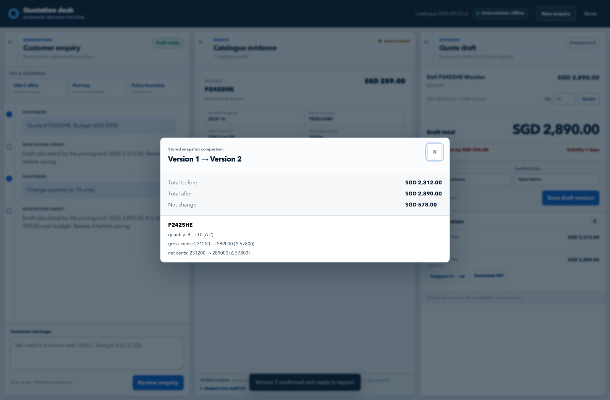

# Quotation Desk — Evidence-Backed AI Quotation Agent

**[Open the live AWS demo](http://47.131.151.253/)** · [中文说明](README.zh-CN.md) · [60-second walkthrough](#see-it-in-60-seconds) · [Architecture](#architecture) · [API contract](docs/api-contract.md) · [Project plan](docs/project-plan-zh.md)

> Turn an ambiguous customer enquiry into a source-linked, versioned and human-approved quotation. Language intelligence handles intent; deterministic tools own product facts and every cent.



## See it in 60 seconds

1. Ask for **eight USB-C monitors under SGD 2,500**. The Agent clarifies whether USB-C must carry video and charge the host laptop.
2. Confirm **P2425HE at zero discount**. The pricing tool returns **SGD 2,312.00** with source-linked specifications.
3. Change the quantity to ten. The new draft becomes **SGD 2,890.00** and exposes the **SGD 390.00** budget gap.
4. Save both immutable versions, inspect the structured diff, confirm the chosen snapshot and export its PDF.

Try the deployed workbench at **[http://47.131.151.253/](http://47.131.151.253/)**. The three demo buttons also exercise the USB-C port trap and the discount policy boundary.

## What makes the workflow trustworthy

- **Evidence at the point of decision.** Important product fields link to the exact manufacturer specification and PDF page.
- **Deterministic money.** Catalogue prices, integer cents, half-up rounding and the 5% ceiling live in one tool layer.
- **Explicit human control.** Suggested alternatives are never silently selected; saved drafts are not treated as approved quotes.
- **Immutable history.** Version 1 remains unchanged when quantity, product or discount changes in Version 2.
- **Export from the approved snapshot.** Diff and PDF read stored snapshots and never ask the model to recreate facts or totals.
- **Visible failure modes.** Unknown stock and delivery stay unknown; policy violations and Gateway fallback remain visible.

## Proof you can inspect

| Evidence | Result |
|---|---|
| Real organizer Gateway, 12-SKU sealed run | **20/20**, every scored dimension 100%, **0 fallback** ([report](reports/evaluation/runs/20260922T073451Z-gateway-fixed-02/report.md)) |
| Untouched first pass | **10/20 preserved** before fixes, with separate repair reports |
| Live Gateway tool execution | 20 cases started, 21 local tool calls, no hidden fallback |
| Browser acceptance | A reload starts a clean enquiry; the final catalogue loads all 50 records and Lenovo evidence; save, revise, diff, confirm and PDF export passed ([report](reports/evaluation/browser_acceptance/20260923T151456Z/report.md)) |
| Pricing and application validation | 77 catalogue/backend/Gateway/evaluation tests passed, including quantity-revision, model-suffix and metadata-conflict guards |
| Agent regression suite | 64/64 cases passed with no OfflineDriver heuristic skips |
| Final catalogue source base | 44 official Dell/Lenovo documents, 754 pages and 400 field-level evidence records |
| Real Gateway timing | 5/5 correct; **12.705 s median** ([report](reports/evaluation/timing/20260922T073821Z-gateway-first-pass/report.md)) |
| Quote PDF QA | 9/9 extraction checks and 8/8 disclosed visual technical checks passed |

The valid first pass and repaired runs are deliberately separate. The final score is a real-model result only when the configured driver is `gateway`, fallback is false and the trace contains Gateway tool turns.

The quoted Gateway score was produced against the original 12-SKU `2026-09-14` catalogue. The final 50-SKU `2026-09-22` catalogue has passed deterministic data, application and Chrome acceptance tests. A fresh 50-SKU Gateway/sealed run is still required before publishing a model score for the final catalogue.

## Product workflow

```text
Customer enquiry → clarify requirements → search the frozen catalogue
→ inspect source evidence → human selects a product → deterministic pricing
→ save immutable draft versions → compare versions → confirm → export PDF
```

> **The model understands language and asks questions; deterministic tools own every fact and every cent.**

The model and browser cannot provide a unit price, calculate a total, silently substitute a SKU, or turn an unknown specification into a fact.

> [!IMPORTANT]
> Product specifications come from publicly accessible Dell and Lenovo documents. Prices, discount rules and customer enquiries are synthetic hackathon data. They do not represent manufacturer pricing, stock, delivery commitments or commercial policy. A calculated or saved draft is not an approved quotation or tax invoice.

## What is shipped

| Area | Working implementation |
|---|---|
| Language layer | Organizer LLM Gateway plus explicit OfflineDriver fallback |
| Trusted tool layer | `search_products`, `get_product` and `calculate_quote` through one dispatcher |
| Web application | FastAPI, SQLite and responsive three-panel browser workbench |
| Evidence | 50 monitor SKUs and 400 field-level source records |
| Quote lifecycle | Draft → immutable saved draft → append-only confirmation → PDF |
| Revision control | Stable line IDs, stale-save protection, idempotent save/confirm and structured diff |
| Auditability | Gateway/fallback badge, tool trace, data/rule versions and source-page links |
| Deployment | Public AWS Lightsail instance behind Nginx |

The authoritative remaining-work sequence and acceptance criteria are in the [consolidated project plan](docs/project-plan-zh.md).

## Quick start

The web application requires Python 3.10 or newer.

```bash
git clone https://github.com/HELLSJ/ISS-Hackson-Quotation-Preparation.git
cd ISS-Hackson-Quotation-Preparation
python3 -m venv .venv
.venv/bin/pip install -r requirements.txt
.venv/bin/uvicorn app.main:app --host 127.0.0.1 --port 8000
```

Open <http://127.0.0.1:8000>. The default `OfflineDriver` needs no cloud credentials. Every page load starts a clean enquiry for the visitor; `storage/app.sqlite` retains the authoritative audit history of messages and saved draft versions.

FastAPI documentation is available at <http://127.0.0.1:8000/docs> while the server is running.

### Try the main demo

Use the three built-in demo shortcuts or enter these turns:

```text
We need 8 monitors with USB-C. Budget SGD 2500.
Video plus at least 65W charging; 23.8-inch FHD is acceptable.
Choose P2425HE at zero discount.
```

The pricing tool returns SGD 2,312.00. Save that as version 1, then enter:

```text
Change quantity to 10 units.
```

The revised draft is SGD 2,890.00, which is SGD 390.00 over budget. Saving it creates version 2 without changing version 1.

## Architecture

```text
Browser workbench (`app/static/`)
  → FastAPI (`app/main.py`)
      → QuotationService
          → OfflineDriver
          → GatewayDriver → organizer LLM Gateway (optional)
      → canonical tool dispatcher (`dell_agent.agent.tools.dispatch`)
          → frozen catalogue, pricing rules, and field evidence
      → `storage/app.sqlite`
          → conversations
          → messages + AgentResult/trace
          → immutable quote_versions + append-only confirmations
      → official manufacturer source links with exact page references
      → stored-snapshot diff and confirmed quote-PDF renderer
```

`storage/catalog.sqlite` is a regenerable catalogue cache. `storage/app.sqlite` stores application conversations and saved quote-draft snapshots. Neither database is committed.

## Canonical tools

All runtime paths—CLI, OfflineDriver, GatewayDriver, FastAPI, and tests—use:

```python
from dell_agent.agent.tools import dispatch
```

| Tool | Responsibility |
|---|---|
| `search_products` | Applies explicit structured filters. Unknown values do not satisfy a filter; no match returns an empty list; exact model aliases prevent suffix substitution. |
| `get_product` | Returns one SKU’s public specifications, synthetic price, field-level evidence, and unavailable stock/delivery fields. |
| `calculate_quote` | Uses catalogue prices only, integer cents, per-line half-up discount rounding, and a maximum discount of 500 bps. |

`scripts/catalog_tools.py` is only a CLI/compatibility adapter and contains no second pricing engine. The frozen result and error shapes are documented in [docs/api-contract.md](docs/api-contract.md).

Examples:

```bash
# USB-C video plus at least 90 W host charging
python scripts/catalog_tools.py search_products \
  '{"usb_c_video":true,"min_pd_watts":90}'

# Inspect one SKU and its evidence
python scripts/catalog_tools.py get_product '{"sku":"MON-007"}'

# Quote 8 P2425HE units within a SGD 2,500 budget
python scripts/catalog_tools.py calculate_quote \
  '{"items":[{"sku":"MON-007","quantity":8}],"budget_cents":250000}'
```

Verified pricing anchors:

| Scenario | Expected result |
|---|---:|
| `MON-007` × 8 at 0 bps | 231,200 cents; within a 250,000-cent budget |
| `MON-007` × 10 at 0 bps | 289,000 cents; 39,000 cents over budget |
| `MON-009` × 2 at 500 bps | 66,310 cents |
| `MON-001` × 7 at 250 bps | 101,692 cents |

## Data and evidence

The catalogue covers three size groups, four resolutions, no/65 W/90 W USB-C host power, and an important data-only trap:

- `usb_c_video` means the upstream USB-C/Thunderbolt connection accepts video;
- `usb_c_pd_watts` means host-laptop power on that video connection;
- `usb_c_downstream_charge_watts` is peripheral charging and cannot replace laptop video/PD;
- U2724D (`MON-010`) has a data-only USB-C upstream port, while U2724DE (`MON-011`) supports video and 90 W host charging;
- `screen_inches` is the precise viewable diagonal, so 23.81 inches does not satisfy a strict 24.0-inch minimum;
- stock and delivery lead time are always unknown in this dataset.

See [data/README.md](data/README.md) for the complete SKU table, field definitions, provenance, and rebuild process.

### Rebuild and validate the data package

Normal application use does not require another download. To regenerate derived data and the catalogue database:

```bash
python scripts/build_data.py
python scripts/validate_data.py
```

Only these two files are intended for manual data maintenance:

- `data/curated_specs.json` — reviewed facts and evidence page numbers;
- `data/synthetic_business.json` — synthetic prices and business rules.

The final catalogue combines the 12 reviewed Dell records with 38 Lenovo/ThinkVision records extracted from official PSREF PDFs. The expansion import is reproducible:

```bash
.venv/bin/pip install -r scripts/requirements-data.txt
.venv/bin/python scripts/import_lenovo_psref.py
.venv/bin/python scripts/build_data.py
.venv/bin/python scripts/validate_data.py
```

The Dell baseline retains its assistant-reviewed evidence. The Lenovo expansion uses deterministic extraction plus schema, page and connectivity checks and has not received an independent human field-by-field audit.

The manufacturer source PDFs are intentionally excluded from the competition submission. The repository retains official download URLs, frozen extracted text, reviewed facts, and exact page references. To reproduce extraction locally, download the sources first and install the separately pinned data dependency:

```bash
python scripts/download_sources.py
.venv/bin/pip install -r scripts/requirements-data.txt
python scripts/extract_sources.py
```

## Tests and evidence boundaries

```bash
.venv/bin/pip install -r requirements-dev.txt
python scripts/build_data.py
python scripts/validate_data.py                            # 15 data/tool checks
.venv/bin/python -m unittest discover -s tests            # 77 catalogue/backend/gateway/evaluation-gate tests
.venv/bin/python -m unittest discover -s dell_agent/tests # 64 Agent tests
```

The current suites report:

- 15 catalogue/CLI contract tests passing;
- 22 temporary-database backend tests passing (migration, snapshots, concurrency, confirmation, diff, PDF, official evidence links, fault injection and HTTP);
- 64 Agent tests passed with no skipped OfflineDriver heuristic cases;
- all three fixed demo scenarios passing in the offline path.

These numbers are not a model accuracy claim for the final catalogue. The 12-SKU expected semantic labels and sealed reports remain historical evidence. Two no-match prompts were revised for the expanded catalogue, and the complete 50-SKU suite requires a fresh model run and review. Holdout answers and validation reports must never be placed in the system prompt or runtime knowledge store.

## Organizer LLM Gateway path

The application calls the organizer supplied gateway directly and does not invoke Amazon Bedrock. No extra cloud SDK is required. Configure the three values from the team email in the current shell:

```bash
read -r "LLM_GATEWAY_URL?Gateway URL: "
read -s "LLM_GATEWAY_API_KEY?Team API key: "; echo
read -r "LLM_MODEL?Model name: "
export LLM_GATEWAY_URL LLM_GATEWAY_API_KEY LLM_MODEL
export AGENT_DRIVER=gateway
.venv/bin/uvicorn app.main:app --host 127.0.0.1 --port 8000
```

The client supports the organizer kit's Ollama-compatible `/api/chat` protocol with `X-API-Key`, plus an OpenAI-compatible URL ending in `/v1`. It accepts native `tool_calls` and the documented JSON tool-request fallback. The API key is read only from the environment and never written to traces, reports, or the database. See [docs/llm-gateway-setup-zh.md](docs/llm-gateway-setup-zh.md). AWS credentials remain relevant only when deploying the app to Lightsail; see [docs/aws-hosting-setup-zh.md](docs/aws-hosting-setup-zh.md).

A live run is valid only when `configured_driver=gateway`, `used_fallback=false`, and the trace contains gateway tool calls.

## Fixed demo stories

1. **Clarify, quote, revise:** an ambiguous eight-monitor USB-C enquiry becomes an SGD 2,312 draft; changing to ten units creates an SGD 2,890 version and exposes the SGD 390 budget gap.
2. **Catch the data-only port:** a request for four U2724D monitors with one-cable video and 90 W charging is blocked with source evidence; U2724DE is suggested but never selected automatically.
3. **Enforce policy:** a 6% discount and next-day delivery request is blocked because the synthetic limit is 5% and delivery data is unavailable.

## Remaining critical path

1. Run and review the Gateway/sealed suite against the final 50-SKU catalogue; keep the 12-SKU reports as historical evidence.
2. Spot-check and countersign the 38-SKU Lenovo expansion if the submission will call it independently reviewed.
3. Complete five human timing observations, rehearse the fixed stories, record the 30-minute video, and submit.

See [docs/project-plan-zh.md](docs/project-plan-zh.md) for owners, acceptance criteria, evaluation thresholds, exception coverage, and the video plan.

## Repository map

```text
app/                    FastAPI, SQLite lifecycle, snapshot validation, diff/PDF, browser workbench
data/                   source, curated, generated, evaluation, and validation data
dell_agent/             typed catalogue, pricing, state machine, tools, drivers
docs/api-contract.md    frozen tool and HTTP contract
docs/project-plan-zh.md single authoritative project plan
scripts/                download, extraction, build, validation, and CLI entry points
tests/                  catalogue/CLI and quote-backend integration tests
agent.md                concise engineering handoff
```

## Source and licensing note

Specifications are derived from official Dell and Lenovo documents linked in `data/processed/sources.csv`. Manufacturer PDFs are not included in this submission; the application opens the official source URL at the recorded page. All prices, rules and enquiries are explicitly synthetic. The 38-SKU Lenovo expansion can be reproduced with `scripts/import_lenovo_psref.py`.
