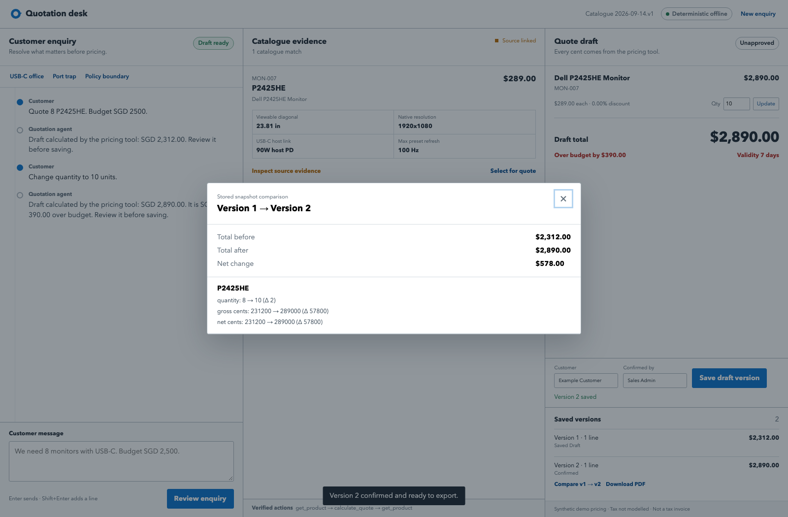

# Quotation Desk：可审计的 AI 报价工作台

**[打开 AWS 在线演示](http://52.221.210.32/)** · [English README](README.md) · [60 秒体验](#60-秒看懂) · [系统架构](#架构) · [API 契约](docs/api-contract.md) · [前端指南](docs/frontend-development-deployment-zh.md) · [项目规划](docs/project-plan-zh.md)

> 把含糊的客户询价变成有原文证据、有版本记录、经人工确认的正式报价快照。模型理解语言，确定性工具掌握产品事实和每一分钱。



## 60 秒看懂

1. 输入“需要 **8 台 USB-C 显示器，预算 SGD 2,500**”。Agent 会先问清 USB-C 是否需要视频和笔记本供电。
2. 确认选择 **P2425HE，零折扣**。计价工具返回 **SGD 2,312.00**，关键规格带 Dell 原文页码。
3. 把数量改成 10。新草稿变为 **SGD 2,890.00**，明确显示**超预算 SGD 390.00**。
4. 保存两个不可变版本，查看结构化 diff，人工确认选定快照并导出 PDF。

直接体验：**[http://52.221.210.32/](http://52.221.210.32/)**。页面内三个演示按钮还覆盖 USB-C 端口陷阱和折扣政策边界。

## 为什么这个工作流可信

- **证据就在决策旁边。**关键产品字段可打开对应 Dell 手册和 PDF 页码。
- **金额由工具确定。**目录价、整数分、half-up 舍入和 5% 上限集中在唯一工具层。
- **人工控制明确。**推荐替代项不会自动选择，保存草稿不会被当成批准报价。
- **历史不可变。**修改数量、产品或折扣时，旧版本保持原样。
- **导出基于确认快照。**diff 和 PDF 只读存储快照，不让模型重新生成事实或金额。
- **失败状态可见。**库存和交付未知会保留为未知；政策阻断和 Gateway fallback 都会显示。

## 可核验的结果

| 证据 | 结果 |
|---|---|
| 组织者真实 Gateway 最终 sealed 评测 | **20/20**，全部计分维度 100%，**0 fallback**（[报告](reports/evaluation/runs/20260922T073451Z-gateway-fixed-02/report.md)） |
| 未修改的有效首轮 | 修复前 **10/20** 原样保留，修复报告单独保存 |
| Gateway 工具执行 | 20 条案例启动，21 次本地工具调用，无隐藏 fallback |
| 浏览器验收 | 保存、修订、diff、确认、PDF、政策阻断和证据渲染通过（[报告](reports/evaluation/browser_acceptance/20260922T075400Z/report.md)） |
| 计价与应用校验 | 60 项目录/后端/Gateway/评测门禁测试通过 |
| Agent 回归 | 64 项完成：57 项通过，7 项为已记录的 OfflineDriver 启发式 skip |
| 证据基础 | 6 份 Dell 手册、522 页、96 条字段级证据 |
| 真实 Gateway 计时 | 5/5 正确，**中位数 12.705 秒**（[报告](reports/evaluation/timing/20260922T073821Z-gateway-first-pass/report.md)） |
| 报价 PDF QA | 9/9 机器提取检查和 8/8 已披露视觉技术审核通过 |

有效首轮与修复后运行严格分开。只有 `configured_driver=gateway`、`used_fallback=false` 且 trace 包含 Gateway 工具调用时，结果才计入真实模型评测。

## 产品流程

```text
客户询价 → 澄清需求 → 查询冻结目录 → 查看原文证据
→ 人工选择产品 → 确定性计价 → 保存不可变草稿版本
→ 对比版本 → 人工确认 → 导出 PDF
```

> **模型负责理解语言和追问；确定性工具拥有所有事实和金额。**

模型和前端不能提供单价、计算总额、静默替换 SKU，或把未知规格变成事实。

> [!IMPORTANT]
> 产品规格来自公开可访问的 Dell 手册。价格、折扣规则和客户询价均为比赛模拟数据，不代表 Dell 的报价、库存、交期或商业政策。计算或保存的草稿不是已批准报价，也不是税务发票。

## 已交付能力

| 模块 | 可运行实现 |
|---|---|
| 语言层 | 组织者 LLM Gateway，以及明确可见的 OfflineDriver fallback |
| 可信工具层 | `search_products`、`get_product`、`calculate_quote` 共用唯一 dispatcher |
| Web 应用 | FastAPI、SQLite 和响应式三栏工作台 |
| 规格证据 | 12 个显示器 SKU、96 条字段级来源记录 |
| 报价生命周期 | 草稿 → 不可变保存版本 → append-only 人工确认 → PDF |
| 修订控制 | 稳定 line ID、stale 防护、保存/确认幂等和结构化 diff |
| 审计能力 | Gateway/fallback 徽章、工具 trace、数据/规则版本和原文页码 |
| 公网部署 | AWS Lightsail + Nginx |

所有后续工作及验收标准见唯一的[项目总规划](docs/project-plan-zh.md)。

## 快速开始

Web 应用要求 Python 3.10+：

```bash
git clone https://github.com/HELLSJ/ISS-Hackson-Quotation-Preparation.git
cd ISS-Hackson-Quotation-Preparation
python3 -m venv .venv
.venv/bin/pip install -r requirements.txt
.venv/bin/uvicorn app.main:app --host 127.0.0.1 --port 8000
```

浏览器打开 <http://127.0.0.1:8000>。默认 `OfflineDriver` 不需要云凭据。浏览器保存当前 conversation ID，`storage/app.sqlite` 是消息和报价草稿版本的真实数据源。

服务运行时可在 <http://127.0.0.1:8000/docs> 查看 FastAPI 文档。

### 运行主演示

依次输入：

```text
We need 8 monitors with USB-C. Budget SGD 2500.
Video plus at least 65W charging; 23.8-inch FHD is acceptable.
Choose P2425HE at zero discount.
```

计价工具返回 SGD 2,312.00。保存 v1 后输入：

```text
Change quantity to 10 units.
```

新草稿是 SGD 2,890.00，超预算 SGD 390.00。保存后成为 v2，v1 不会改变。

## 架构

```text
Browser workbench (`app/static/`)
  → FastAPI (`app/main.py`)
      → QuotationService
          → OfflineDriver
          → GatewayDriver → 组织者 LLM Gateway（可选）
      → 唯一工具入口 (`dell_agent.agent.tools.dispatch`)
          → 冻结目录、计价规则和字段证据
      → `storage/app.sqlite`
          → conversations
          → messages + AgentResult/trace
          → immutable quote_versions + append-only confirmations
      → manifest 白名单中的本地 Dell PDF
      → stored-snapshot diff 和 confirmed quote PDF renderer
```

`storage/catalog.sqlite` 是可重建目录缓存；`storage/app.sqlite` 保存应用对话和报价草稿快照。两者都不提交到 Git。

## 三个确定性工具

所有运行路径——CLI、OfflineDriver、GatewayDriver、FastAPI 和测试——均调用：

```python
from dell_agent.agent.tools import dispatch
```

| 工具 | 责任 |
|---|---|
| `search_products` | 使用明确的结构化条件筛选；未知值不满足筛选；无匹配返回空；精确型号阻止后缀替换 |
| `get_product` | 返回 SKU 的公开规格、模拟价格、字段证据，以及不可用的库存/交期 |
| `calculate_quote` | 只使用目录价格、整数分、逐行 half-up 折扣和 500 bps 上限 |

`scripts/catalog_tools.py` 只是 CLI/兼容包装，不包含第二套计价逻辑。完整返回值和错误码见 [docs/api-contract.md](docs/api-contract.md)。

```bash
python scripts/catalog_tools.py search_products \
  '{"usb_c_video":true,"min_pd_watts":90}'

python scripts/catalog_tools.py get_product '{"sku":"MON-007"}'

python scripts/catalog_tools.py calculate_quote \
  '{"items":[{"sku":"MON-007","quantity":8}],"budget_cents":250000}'
```

已核对金额锚点：

| 场景 | 结果 |
|---|---:|
| `MON-007` × 8，0 bps | 231200 分，预算 250000 分以内 |
| `MON-007` × 10，0 bps | 289000 分，超预算 39000 分 |
| `MON-009` × 2，500 bps | 66310 分 |
| `MON-001` × 7，250 bps | 101692 分 |

## 数据和证据

目录覆盖不同尺寸、四档分辨率，以及无/65W/90W USB-C 主机供电。必须区分：

- `usb_c_video`：上行 USB-C/Thunderbolt 是否接收视频；
- `usb_c_pd_watts`：上述视频连接给笔记本的供电；
- `usb_c_downstream_charge_watts`：给外设充电，不能替代笔记本视频/PD；
- U2724D（`MON-010`）是 data-only USB-C；U2724DE（`MON-011`）支持视频和 90W；
- `screen_inches` 是实际可视对角线，23.81 英寸不满足严格 24.0 英寸；
- 当前数据没有库存和交期。

完整 SKU、字段和来源见 [data/README.md](data/README.md)。

### 重建与校验

正常运行不需要重新下载。重建派生数据和目录数据库：

```bash
python scripts/build_data.py
python scripts/validate_data.py
```

只应该人工维护：

- `data/curated_specs.json`：已核对事实和证据页码；
- `data/synthetic_business.json`：模拟价格和规则。

重新提取 PDF 需要：

```bash
.venv/bin/pip install -r scripts/requirements-data.txt
python scripts/extract_sources.py
```

## 测试和可信边界

```bash
.venv/bin/pip install -r requirements-dev.txt
python scripts/build_data.py
python scripts/validate_data.py                            # 15 项数据/工具检查
.venv/bin/python -m unittest discover -s tests            # 60 项目录/后端/Gateway/评测门禁测试
.venv/bin/python -m unittest discover -s dell_agent/tests # 64 项 Agent 测试
```

当前结果：

- 15 项目录/CLI 契约测试通过；
- 19 项临时数据库后端测试通过，覆盖迁移、快照、并发、确认、diff、PDF、故障注入和 HTTP；
- 64 项 Agent 测试完成：57 项通过，7 项为明确记录的 OfflineDriver 启发式 skip；
- 三条固定演示均在离线路径通过。

这不是模型准确率。现有 40 条自然语言案例的 expected label 已独立审核；新建 sealed holdout 已完成 20/20 Codex 技术审核并冻结哈希门禁。若对外声称“独立人工审核”，仍需一名非作者队员实名复签。其答案和校验报告不得进入系统提示词或运行时知识库。

## 组织者 LLM Gateway 路径

应用直接调用组织者提供的 Gateway，不直接调用 Amazon Bedrock，也不需要额外云 SDK。把团队邮件中的三个值配置到当前终端：

```bash
read -r "LLM_GATEWAY_URL?Gateway URL: "
read -s "LLM_GATEWAY_API_KEY?Team API key: "; echo
read -r "LLM_MODEL?Model name: "
export LLM_GATEWAY_URL LLM_GATEWAY_API_KEY LLM_MODEL
export AGENT_DRIVER=gateway
.venv/bin/uvicorn app.main:app --host 127.0.0.1 --port 8000
```

客户端支持 Starter Kit 的 Ollama 兼容 `/api/chat` + `X-API-Key` 协议，也支持以 `/v1` 结尾的 OpenAI 兼容地址；同时处理原生 `tool_calls` 和 JSON 工具请求 fallback。API key 只从环境变量读取，不写入 trace、报告或数据库。具体步骤见 [LLM Gateway 配置指南](docs/llm-gateway-setup-zh.md)。AWS 凭据只用于部署 Lightsail，见 [AWS 托管指南](docs/aws-hosting-setup-zh.md)。

只有 `configured_driver=gateway`、`used_fallback=false` 且 trace 中存在 Gateway 工具调用，才算真实模型路径成功。

## 三条固定演示

1. **澄清、报价、修订：**8 台模糊 USB-C 需求变成 SGD 2,312 草稿；改成 10 台后是 SGD 2,890，并显示 SGD 390 预算差额。
2. **识别 data-only：**要求 U2724D 一根线传视频和 90W 时必须阻断并展示证据；可以建议 U2724DE，但不能自动选择。
3. **守住规则：**6% 折扣和明日交货要求必须被阻断，因为模拟上限为 5%，交期数据未知。

## 后续关键路径

1. 完成 5 条真人计时；有效 Gateway 计时中位数为 12.705 秒，范围 9.025–19.633 秒；
2. 仅当提交材料声称“独立人工审核”时，请非作者队员复签 sealed/PDF 技术审核；
3. 彩排固定故事、录制 30 分钟视频并提交。

详细负责人、验收标准、指标、异常矩阵和视频结构见 [docs/project-plan-zh.md](docs/project-plan-zh.md)。

## 仓库结构

```text
app/                    FastAPI、SQLite 生命周期、快照校验、diff/PDF、浏览器工作台
data/                   原始、核对、生成、评估和校验数据
dell_agent/             类型目录、计价、状态机、工具和 driver
docs/api-contract.md    冻结的工具与 HTTP 契约
docs/frontend-development-deployment-zh.md 前端优化、验收、协作与 Lightsail 发布
docs/project-plan-zh.md 唯一项目总规划
scripts/                下载、提取、构建、校验和 CLI
tests/                  目录/CLI 契约与报价后端集成测试
agent.md                工程交接摘要
```

## 来源和许可

产品规格来自 `data/processed/sources.csv` 中链接的 Dell 手册。原 PDF 保留 Dell 版权；公开可下载不代表可自由再分发，公开提交前必须确认许可。所有价格、规则和询价均明确为模拟数据。
