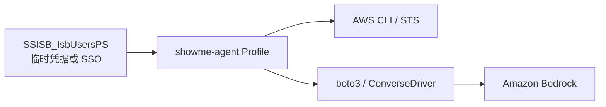
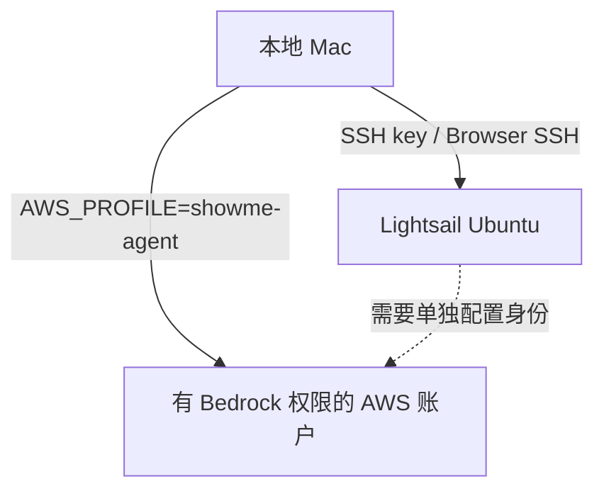

# AWS 凭据与 `SSISB_IsbUsersPS` 配置指南

本文说明如何在本项目中使用 `SSISB_IsbUsersPS` 对应的 AWS 临时凭据。文档只使用占位符；任何真实 Access Key、Secret Key 或 Session Token 都不能写入仓库、Markdown、`.env` 或源代码。

## 1. 是否只能在当前终端配置

取决于配置方式：

| 方式 | 保存位置 | 作用范围 | 关闭终端后 | 凭据过期后 |
|---|---|---|---|---|
| `export AWS_...` | 当前 shell 内存 | 当前终端及其子进程 | 失效 | 重新取得并导出三项新值 |
| Named Profile | `~/.aws/credentials` | 所有终端和 boto3/AWS CLI | 仍可读取 | 用新三项临时凭据覆盖 Profile |
| AWS SSO Profile，推荐 | `~/.aws/config` 和本地 SSO cache | 所有终端和 boto3/AWS CLI | 配置保留 | 重新运行 `aws sso login` |

`export` 确实只影响当前终端。对本项目更合适的做法是保存一个名为 `showme-agent` 的 Profile；Profile 名称不需要和 Permission Set 名称相同。



## 2. 开始前确认

进入项目：

```bash
cd 项目位置
source .venv/bin/activate
```

检查 AWS CLI：

```bash
aws --version
```

如果手里的是 SSO/AssumeRole 临时凭据，必须同时具备：

```text
AWS_ACCESS_KEY_ID
AWS_SECRET_ACCESS_KEY
AWS_SESSION_TOKEN
```

缺少 `AWS_SESSION_TOKEN` 时，`ASIA...` 开头的临时 Access Key 无法使用。

## 3. 方案 A：只在当前终端使用

将 AWS 页面提供的三项最新临时凭据导入当前终端。变量名使用普通下划线，不能带反斜杠：

```bash
export AWS_ACCESS_KEY_ID="<temporary-access-key>"
export AWS_SECRET_ACCESS_KEY="<temporary-secret-key>"
export AWS_SESSION_TOKEN="<temporary-session-token>"
export AWS_REGION="us-east-1"
export AWS_DEFAULT_REGION="us-east-1"
```

只检查变量是否存在，不显示值：

```bash
env | awk -F= '/^AWS_(ACCESS_KEY_ID|SECRET_ACCESS_KEY|SESSION_TOKEN|REGION|DEFAULT_REGION)=/ {print $1"=<set>"}'
```

验证身份：

```bash
.venv/bin/python - <<'PY'
import boto3
import json

client = boto3.client("sts", region_name="us-east-1")
print(json.dumps(client.get_caller_identity(), indent=2))
PY
```

成功后会显示 `Account` 和 `Arn`。关闭该终端后，以上 `export` 全部消失。

## 4. 方案 B：保存为 `showme-agent` Profile

先按方案 A 导入三项有效凭据并确认 STS 成功，再执行：

```bash
aws configure set aws_access_key_id "$AWS_ACCESS_KEY_ID" --profile showme-agent
aws configure set aws_secret_access_key "$AWS_SECRET_ACCESS_KEY" --profile showme-agent
aws configure set aws_session_token "$AWS_SESSION_TOKEN" --profile showme-agent
aws configure set region "us-east-1" --profile showme-agent
aws configure set output "json" --profile showme-agent
```

这些设置保存在用户目录的 `~/.aws/`，不在项目仓库内。

清除当前终端的原始环境变量，以确认后续调用确实来自 Profile：

```bash
unset AWS_ACCESS_KEY_ID
unset AWS_SECRET_ACCESS_KEY
unset AWS_SESSION_TOKEN
unset AWS_REGION
unset AWS_DEFAULT_REGION
```

验证 Profile：

```bash
AWS_PROFILE=showme-agent aws sts get-caller-identity
```

验证项目中的 boto3：

```bash
AWS_PROFILE=showme-agent AWS_REGION=us-east-1 \
.venv/bin/python - <<'PY'
import boto3
import json

session = boto3.Session(profile_name="showme-agent", region_name="us-east-1")
credentials = session.get_credentials()
print("credential_source:", credentials.method if credentials else None)
print("region:", session.region_name)
print(json.dumps(session.client("sts").get_caller_identity(), indent=2))
PY
```

正常情况下，`credential_source` 为 `shared-credentials-file`。

以后在任意终端中可以这样使用：

```bash
AWS_PROFILE=showme-agent AWS_REGION=us-east-1 <command>
```

不建议把 `AWS_PROFILE=showme-agent` 永久写入全局 shell 配置，因为本机可能同时使用多个 AWS 账户。给每条项目命令显式加前缀更容易避免调错账户。

## 5. 方案 C：配置 AWS SSO Profile，推荐长期使用

如果团队提供 AWS Access Portal 地址，优先使用 SSO：

```bash
aws configure sso --profile showme-agent
```

按向导填写：

```text
SSO session name: showme-agent-sso
SSO start URL: 团队提供的 AWS Access Portal URL
SSO region: IAM Identity Center 所在区域
SSO registration scopes: 直接按 Enter
Account: 具有 Bedrock 权限的账户
Role/Permission Set: SSISB_IsbUsersPS 对应项
CLI default client Region: us-east-1
CLI default output format: json
CLI profile name: showme-agent
```

登录：

```bash
aws sso login --profile showme-agent
```

验证：

```bash
AWS_PROFILE=showme-agent aws sts get-caller-identity
```

SSO 会话过期后，只需再次执行 `aws sso login --profile showme-agent`，不需要手工更新三项密钥。AWS 官方流程见 [Configuring IAM Identity Center authentication with the AWS CLI](https://docs.aws.amazon.com/cli/latest/userguide/cli-configure-sso.html)。

### 5.1 Bedrock API key（开发测试的替代认证）

当前项目的 boto3 版本支持 Bedrock bearer token。API key 与 `showme-agent` Profile 是二选一的运行时认证方式；项目不需要同时使用二者。API key 只适用于 Bedrock/Bedrock Runtime，不能代替 STS 或其他 AWS 服务凭据。

在当前终端安全读入 key：

```bash
unset AWS_ACCESS_KEY_ID AWS_SECRET_ACCESS_KEY AWS_SESSION_TOKEN AWS_PROFILE
read -s "AWS_BEARER_TOKEN_BEDROCK?Bedrock API key: "
echo
export AWS_BEARER_TOKEN_BEDROCK
export AWS_REGION="ap-southeast-1"
export AWS_DEFAULT_REGION="ap-southeast-1"
export BEDROCK_MODEL_ID="amazon.nova-lite-v1:0"
```

不要把真实 key 写入仓库、`.env`、Markdown 或 shell 历史。长期 API key 适合探索和短期开发；正式部署应使用短期凭据或工作负载角色。API key 仍受 IAM、SCP、模型和区域权限限制，不能绕过组织策略。

## 6. 本项目的使用方法

首先确认 Profile 指向正确的 Bedrock 账户：

```bash
AWS_PROFILE=showme-agent aws sts get-caller-identity
```

然后检查账户能否读取 Bedrock 模型目录：

```bash
AWS_PROFILE=showme-agent \
aws bedrock list-foundation-models \
  --region us-east-1 \
  --query 'modelSummaries[].{id:modelId,name:modelName}'
```

选择支持 Converse/tool use 且账户可访问的模型后，再运行项目评测：

```bash
AWS_PROFILE=showme-agent \
AWS_REGION=us-east-1 \
BEDROCK_MODEL_ID="<supported-model-or-inference-profile-id>" \
.venv/bin/python scripts/run_formal_evaluation.py \
  --driver converse \
  --label first-pass
```

正式运行前，sealed holdout 的非作者审核必须已完成并执行：

```bash
.venv/bin/python scripts/prepare_sealed_holdout_review.py --finalize
```

运行器会在审核未完成、sealed 哈希不一致或发生 Offline fallback 时返回失败，不会把 fallback 结果计作真实模型指标。

## 7. 账户与 SSH 的关系

Lightsail SSH 和 Bedrock API 身份相互独立：



SSH 成功只表示可以进入 Ubuntu，不会自动为本地 boto3 提供 AWS API 凭据。Lightsail 与 Bedrock 可以位于不同 AWS 账户；正式评测应记录实际调用 Bedrock 的 Account ID、Region 和 model ID。

## 8. 常见错误

### `ExpiredToken`

临时 Session Token 已过期。旧值无法刷新；从 Access Portal 取得完整的新三项凭据，或重新执行：

```bash
aws sso login --profile showme-agent
```

### `ProfileNotFound: showme-agent`

`AWS_PROFILE=showme-agent` 只会选择 Profile，不会创建它。先完成方案 B 或方案 C。

查看现有 Profile：

```bash
.venv/bin/python -c 'import boto3; print(boto3.Session().available_profiles)'
```

### `AccessDeniedException`

身份有效，但没有目标操作权限。确认所选账户/角色允许目标模型的 `bedrock:InvokeModel`；Converse 推理也受该权限控制。参考 [Amazon Bedrock identity-based policy examples](https://docs.aws.amazon.com/bedrock/latest/userguide/security_iam_id-based-policy-examples.html)。

如果错误包含 `explicit deny in a service control policy`，拒绝来自 AWS Organizations 的 SCP。IAM Allow、Permission Set 或 Bedrock API key 都不能覆盖 SCP 的显式 Deny；组织管理员必须删除该 Deny、缩小其条件范围，或将工作负载移到允许目标 Bedrock 操作的账户/OU。

本项目在 2026-09-22 已分别验证两种身份：SSO 角色的 `bedrock:ListFoundationModels`，以及独立 Bedrock API key IAM 用户在 `ap-southeast-1` 对 Nova Lite 的 `bedrock:InvokeModel`，均被 SCP `p-md82f7b5` 显式拒绝。因此当前阻塞不属于本机配置错误。

### STS 账户与预期不一致

立即停止真实评测，重新选择正确 Profile。Lightsail 账户和 Bedrock 账户可以不同，但不能把两个 Session 的 Access Key、Secret Key 和 Session Token 混在一起。

## 9. 安全检查

- 不把真实凭据写入本文件、README、项目计划或 issue；
- 不把凭据提交到 Git；
- 不把凭据发到聊天、Slack 或截图中；
- 不把临时凭据写入项目 `.env`；
- 使用 `aws sts get-caller-identity` 核对账户，不用打印凭据本身；
- 临时凭据过期后获取新的一组三项值，不复用旧 Session Token。

仓库 `.gitignore` 已忽略 `.env`、`credentials`、`.aws/`、`*.pem` 和 `*.key`，但仍应在提交前运行凭据扫描。
