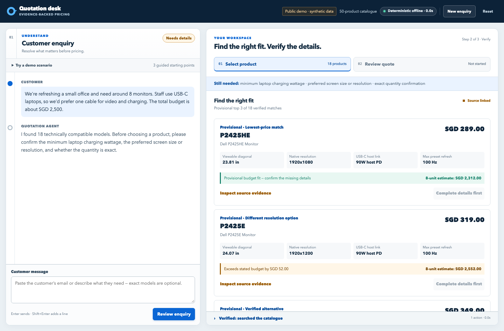
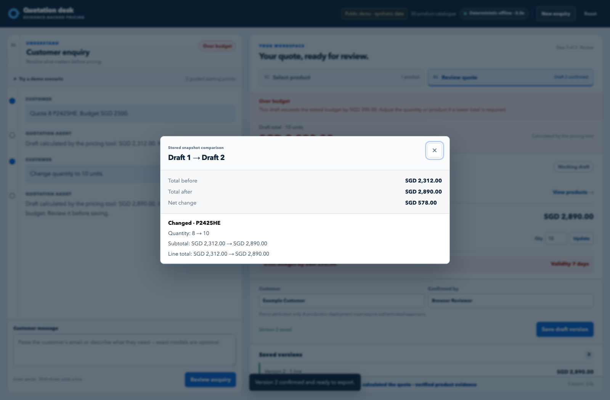

# Quotation Desk business proposal

Show Me Your Agents Hackathon | September 2026

**Project:** Quotation Desk  
**Team code:** [Add registered team code]  
**Repository:** [Quotation Desk source repository](https://github.com/HELLSJ/ISS-Hackson-Quotation-Preparation)
**Live workbench:** [Quotation Desk live demo](http://47.131.151.253/)

## Pilot request

We propose a two-week pilot with one quotation employee and one reviewer. Quotation Desk turns an incomplete monitor enquiry into a reviewable draft with manufacturer evidence, deterministic pricing, and an audit trail of saved drafts. The final catalogue contains 50 Dell and Lenovo/ThinkVision models.

The pilot has one purpose: determine whether staff can prepare correct quotations with less time and rework than the current manual process. It would use de-identified enquiries and synthetic prices. Customer-facing use would be considered only after the business measures the workflow and adds the controls listed later in this proposal.

## The business problem

A customer may ask for "eight USB-C monitors under SGD 2,500." That is not enough information to select a product. USB-C may mean video input, laptop charging, or a data-only port. The quotation employee must clarify the request, compare models, check source documents, calculate the total, record any discount, seek approval, and prepare a document for the customer. A change from eight units to ten can require the same checks again.

Small sales teams often carry this work across email, specification PDFs, price sheets, calculators, and approval messages. A model name can look correct while its port direction or charging capacity is wrong. A calculation error or overwritten draft can also make an earlier price difficult to explain.

These are plausible workflow risks, not measured losses at a participating SME. The proposed pilot will record preparation time, corrections, and rework instead of assuming how often those problems occur.

The initial scope is deliberately narrow: monitor enquiries within a maintained catalogue. Stock, delivery dates, tax, customer-specific contracts, and manufacturer prices are outside the prototype's data. Staff must handle those matters through the normal commercial process before making a commitment.

## How the workflow changes

| Current manual process | Quotation Desk process |
|---|---|
| Read the enquiry and identify missing details | The Agent identifies missing requirements and asks focused questions |
| Search specifications and compare models | The catalogue returns matching products with manufacturer source pages |
| Calculate prices and check discounts manually | A deterministic tool calculates in integer cents and enforces the 5% demo limit |
| Pass drafts through email or separate files | Each saved draft remains unchanged and can be compared with the next |
| Prepare the final document | A reviewer confirms one saved snapshot before PDF export |

## Outcome shown in the prototype

The first browser outcome starts with a broad office request: around eight monitors, one USB-C cable for video and charging, and a budget of about SGD 2,500. The system finds 18 technically compatible records but does not treat that as a recommendation. It asks for the minimum charging wattage, screen preference, and exact quantity. Product selection remains disabled until those details are supplied.

Figure 1. The workbench separates a plausible match from a quote-ready decision. It displays three provisional products, source links, and estimated totals while keeping selection locked until the missing requirements are confirmed.

After the user confirms exactly eight units, at least 90 W charging, and a 24-inch FHD preference, the catalogue returns three matching models. The user can then select a product. Selecting from a product card starts a one-unit draft by design; the interface warns that the original enquiry mentioned eight units and offers a direct way to restore that quantity.

<!-- pagebreak -->

For Dell P2425HE, the synthetic unit price is SGD 289. Eight units produce an SGD 2,312 draft at zero discount. Changing the quantity to ten produces SGD 2,890, which is SGD 390 above the stated budget. The comparison records the SGD 578 increase and leaves the first saved draft unchanged.

Figure 2. The browser reads both totals from stored snapshots. The confirmed PDF is generated from the selected snapshot rather than from a fresh model response.

Two additional test cases cover common quotation risks. Dell U2724D has a data-only USB-C upstream connection, so it cannot satisfy a one-cable video and 90 W laptop-charging request. The system can show U2724DE as a sourced alternative, but it cannot select it for the user. A separate request for a 6% discount and next-day delivery is blocked because the demo limit is 5% and the catalogue has no delivery lead-time data.

## Why an Agent is used

Customer wording varies, and missing requirements are rarely expressed as form fields. The Agent translates that wording into structured searches and focused questions. It can call three tools: search the catalogue, retrieve one product with field-level evidence, and calculate a draft.

The Agent does not own the commercial facts. Search filters distinguish USB-C video input from host power and accessory charging. Missing data cannot satisfy a requirement, and a similar model name cannot replace the requested model. The pricing tool uses integer cents, applies one rounding rule, and rejects discounts above the configured limit.

SQLite stores each saved draft and records confirmation separately. The PDF reads the confirmed snapshot, so later conversation turns cannot alter its figures. Staff can inspect the tool trace, source links, and saved-draft history. The page also shows when the organizer's LLM Gateway falls back to the deterministic offline path; fallback runs are excluded from real-model evaluation.

<!-- pagebreak -->

## Business value and measurement

Quotation Desk puts requirement clarification, product evidence, price calculation, and draft history in one workbench. The pilot will test whether that reduces preparation time and rework without weakening review.

The employee should complete the same five de-identified cases manually and with Quotation Desk, using the same catalogue and pricing rules. Timing starts when the employee reads the enquiry and ends when a draft is ready for review. A result counts as correct only when the product choice, calculation, and policy handling are correct. The pilot report should include the sample size, median, range, and all manual corrections for both methods.

| Outcome | Evidence available now | Pilot acceptance measure |
|---|---|---|
| Preparation time | Five correct organizer Gateway cases had a median Agent response of 12.705 seconds, with a 9.025 to 19.633 second range. Human timing and the full review journey remain unmeasured. | Compare matched manual and assisted cases and report both distributions. |
| Price accuracy | Automated tests cover pricing, saved snapshots, confirmation, PDF export, quantity revision, and independent amount reconciliation. | Every pilot total matches an independent recalculation in cents. |
| Specification traceability | The catalogue contains 50 models and 400 field-level evidence records linked to 44 official source documents covering 754 pages. | Every specification used in a pilot recommendation has a manufacturer source and page. |
| Policy and approval | The prototype blocks discounts above 5%, preserves unknown delivery data, and prevents export until a saved draft is confirmed. | No prohibited discount, invented delivery promise, or unconfirmed PDF appears in the pilot cases. |
| Service quality | No SME response-time or conversion baseline has been measured. | Record time to a reviewable quote, corrections, and staff feedback before making customer-service claims. |

If the pilot shows a time saving, the business can estimate labour value as minutes saved per quote multiplied by monthly quotation volume and loaded staff cost per minute. Those inputs are currently unknown. Any claim about conversion would need a separate sales baseline and a longer observation period.

<!-- pagebreak -->

## Evidence available now

The final data package contains 50 monitor models, 50 synthetic prices, and 400 field-level evidence records. Local validation reports 17 offline data and tool checks with no failures or errors. The latest browser acceptance run passed all 15 recorded steps, including broad-brief clarification, a three-product shortlist, one-unit selection, quantity restoration, saved-draft comparison, confirmation, PDF download, and agreement between page, snapshot, and PDF amounts.

The application test suites currently pass 80 backend, API, Gateway, and evaluation-gate tests plus 64 Agent tests. These automated checks establish deterministic behaviour and the browser lifecycle. They are not a measurement of employee productivity.

The real organizer Gateway was previously evaluated against the 12-SKU catalogue. The untouched first pass scored 10 of 20 cases. After documented fixes, a separate run passed all 20 cases with no fallback. Those reports show that the Gateway tool loop can work, but they are not a model score for the final 50-SKU catalogue. A new 50-SKU Gateway evaluation is still required.

The Lenovo expansion has passed machine validation and browser loading. An independent spot check by someone other than the import author remains open. The proposal therefore describes the source base as official manufacturer material with automated validation, not as a completed independent human audit.

## Pilot plan and decision

During the two-week pilot, the employee will work matched manual and assisted cases. The reviewer will check corrections, source links, saved-draft comparisons, policy blocks, and confirmed PDFs. Gateway fallback will be recorded separately.

The pilot can run on the existing FastAPI, SQLite, Nginx, systemd, and AWS Lightsail deployment. One maintainer should own product facts and synthetic business rules during the test. The catalogue and prices should remain frozen for the measurement period.

Live commercial use would require approved prices, tax handling, inventory and delivery data, authenticated roles, HTTPS, backups, monitoring, recovery procedures, and an approval policy. Manufacturer source documents also need an agreed linking or distribution approach. A shared database and CRM or ERP integration should be considered only when quotation volume and operating needs justify them.

After two weeks, the reviewer can decide whether to extend the trial using matched timing results, independent price checks, source-page review, and confirmation history. Five matched cases can justify a broader test, but they cannot establish a lasting productivity gain. Any failed case should be investigated before expanding use.

## Evidence links

- [Final catalogue validation](https://github.com/HELLSJ/ISS-Hackson-Quotation-Preparation/blob/main/data/validation/report.json)
- [Latest browser acceptance record](https://github.com/HELLSJ/ISS-Hackson-Quotation-Preparation/blob/main/reports/evaluation/browser_acceptance/20260924T074557Z/report.md)
- [12-SKU sealed Gateway evaluation](https://github.com/HELLSJ/ISS-Hackson-Quotation-Preparation/blob/main/reports/evaluation/runs/20260922T073451Z-gateway-fixed-02/report.md)
- [Gateway timing report](https://github.com/HELLSJ/ISS-Hackson-Quotation-Preparation/blob/main/reports/evaluation/timing/20260922T073821Z-gateway-first-pass/report.md)
- [Live workbench](http://47.131.151.253/)
